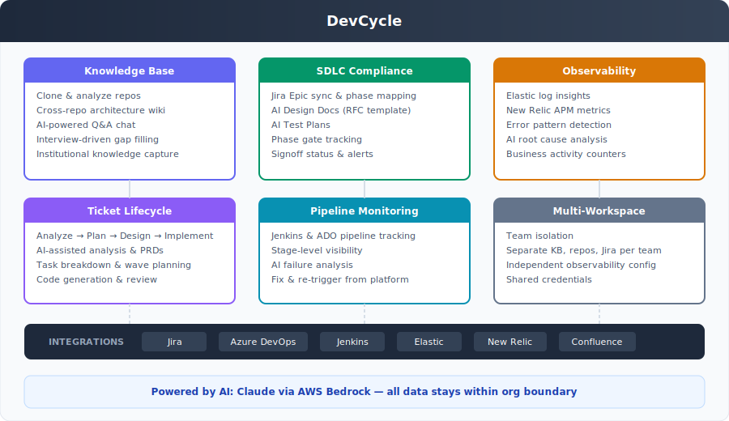

# DevCycle

**AI-powered engineering platform that deeply understands your codebase, accelerates engineering workflows from ticket to deployment, and produces SDLC compliance artifacts automatically — giving leadership real-time visibility without slowing teams down.**

DevCycle connects to your repositories, builds a structured knowledge base of your systems, and uses that understanding to power the full engineering lifecycle: intelligent ticket analysis, AI-assisted implementation, automated design docs and test plans, deployment tracking, and production observability. For regulated organizations, compliance becomes the default state — not a scramble before audits.

---

## The Problem

Engineering management at regulated financial institutions faces a persistent set of pain points:

| Pain Point | Impact |
|---|---|
| **SDLC docs are missing or stale** | Design docs and test plans are written retroactively -- or not at all. Teams scramble before audits to produce documentation that should have existed from the start. |
| **No single view of compliance status** | Artifacts are scattered across Confluence, Jira, Sharepoint, and tribal knowledge. Nobody knows which Epics are missing docs until an auditor asks. |
| **Documentation is tedious** | Engineers avoid writing RFCs and test plans because it takes hours and the output is often formulaic. The work feels low-value even though it is high-stakes. |
| **Codebase knowledge lives in people's heads** | When senior engineers leave, institutional knowledge about system architecture, service dependencies, and design decisions leaves with them. |
| **Observability is fragmented** | Logs in Elastic, APM in New Relic, builds in Jenkins, tickets in Jira -- context is scattered across six tools. Incident response means tab-switching. |
| **Pipeline failures lack context** | A failed Jenkins build produces a stack trace. Understanding *why* it failed and *what to do* requires someone who already knows the system. |

---

## Solution Overview

DevCycle is a single platform that connects to your existing tools, builds deep understanding of your systems, and uses that understanding to power the full engineering lifecycle — from ticket analysis to deployment monitoring — with compliance as a natural output.



---

## Feature Deep-Dives

---

### 1. Knowledge Base -- AI-Powered Codebase Understanding

The KB is the foundation. Every other feature in DevCycle draws on it.

**How it works:**

1. **Connect Azure DevOps** -- Provide your org URL and PAT. DevCycle discovers all repos across your ADO projects.
2. **Select repos** -- Choose which repositories to include. Each workspace maintains its own repo set.
3. **Deep scan** -- DevCycle clones each repo and runs multi-pass AI analysis:
   - Architecture and service boundaries
   - API contracts and data models
   - Cross-repo dependencies and communication patterns
   - Configuration, deployment, and infrastructure
4. **Interview** -- After the scan, DevCycle asks targeted questions to fill gaps the code alone cannot answer (business context, team ownership, historical decisions).
5. **Structured wiki** -- The output is a navigable wiki with an INDEX.md, per-repo deep dives, cross-cutting architecture pages, and synthesized system understanding.

**Q&A Chat:**

A persistent chat interface lets anyone ask questions about the system with full KB context. Sessions are saved and can be resumed. The AI reads the relevant wiki pages before answering, so responses reflect actual system architecture rather than generic advice.

| Capability | Detail |
|---|---|
| Multi-repo analysis | Understands how services interact across repositories |
| Structured output | Wiki pages organized by topic, not just raw notes |
| Persistent sessions | Chat history is saved per workspace |
| Scoped context | AI selects relevant wiki pages per question (not brute-force) |

---

### 2. SDLC Compliance Dashboard

> This is the flagship feature. The pitch: **"Your SDLC docs write themselves. Open the dashboard, see every Epic's compliance status. Click generate, get an RFC-quality design doc in 30 seconds. Audit prep goes from weeks to minutes."**

#### The Compliance Problem

Your organization has an SDLC procedure. It defines phases, required artifacts, and signoff gates. In practice:

- Engineers skip the Design Doc because it takes two hours to write
- Test Plans are copied from the last Epic and never updated
- Nobody knows which Epics are missing documentation until someone manually checks
- Audit prep is a fire drill: retroactive doc generation, chasing approvals, hoping nothing falls through

#### What DevCycle Does

DevCycle syncs your Jira Epics, maps them to SDLC phases, and provides a compliance dashboard that shows management exactly where every Epic stands -- with the ability to generate missing artifacts on demand using AI that actually understands your systems.

#### Architecture

```
  Jira Cloud                    DevCycle                         AI Generation
 +-----------+            +------------------+              +------------------+
 |           |   sync     |                  |   context    |                  |
 |  Epics    +----------->|  sdlc_epics      +------------->|  Context Assembly|
 |  Stories  |            |  sdlc_artifacts  |              |  (Haiku picks    |
 |  Statuses |            |  sdlc_signoffs   |              |   relevant KB    |
 |           |            |  phase_config    |              |   pages)         |
 +-----------+            +------------------+              +--------+---------+
                                  |                                  |
                                  v                                  v
                          +------------------+              +------------------+
                          |  Compliance      |              |  Sonnet generates|
                          |  Dashboard       |              |  Design Doc (RFC)|
                          |                  |              |  Test Plan       |
                          |  Alert cards     |              |  Section by      |
                          |  Phase pipeline  |              |  section         |
                          |  Epic table      |              +------------------+
                          +------------------+
```

#### Compliance Dashboard (Management View)

The landing page is purpose-built for engineering leadership.

**Alert Cards** -- Four cards at the top surface what needs attention immediately:

| Alert | What it shows |
|---|---|
| Missing Design Docs | Epics past the Design phase with no RFC generated |
| Missing Test Plans | Epics approaching or in Testing with no test plan |
| Overdue Signoffs | Artifacts awaiting VP Eng, Solution Architect, or PM approval past SLA |
| Stale Drafts | AI-generated docs that were never reviewed or edited |

**Phase Pipeline** -- Epics grouped visually by SDLC phase:

```
  Initiation     Design      Development     Testing      Deployment     Disposal
  +----------+  +----------+  +----------+  +----------+  +----------+  +----------+
  |          |  |  CLN-301 |  |  CLN-298 |  |  CLN-295 |  |  CLN-290 |  |          |
  |          |  |  CLN-305 |  |  CLN-299 |  |  CLN-296 |  |          |  |          |
  |          |  |  CLN-310 |  |  CLN-302 |  |          |  |          |  |          |
  +----------+  +----------+  +----------+  +----------+  +----------+  +----------+
```

**Epic Table** -- Sortable, filterable table with columns:

| Epic | Title | SDLC Phase | Design Doc | Test Plan | Signoff |
|---|---|---|---|---|---|
| CLN-301 | ACH Batch Processing Redesign | Design | Draft | Missing | Pending (0/3) |
| CLN-298 | Wire Transfer Rate Limiting | Development | Reviewed | Draft | Partial (1/3) |
| CLN-295 | Loan Origination API v3 | Testing | Approved | Reviewed | Complete (3/3) |

Status badges use clear visual language: **Missing** (red), **Draft** (amber), **Reviewed** (blue), **Approved** (green).

#### AI-Generated Design Documents (RFC Format)

When an engineer clicks "Generate Design Doc" on an Epic, DevCycle:

1. **Assembles context** -- Sends the KB INDEX.md + Epic description to a fast model (Haiku) to identify which wiki pages are relevant. Loads those pages plus all linked Jira Stories into a context bundle.
2. **Shows context preview** -- The engineer sees exactly what context the AI will use (which KB pages, which Stories, what acceptance criteria). They can proceed or start an interview to strengthen thin descriptions.
3. **Generates the RFC** -- Using your organization's actual RFC template structure, Sonnet generates a complete document streamed section by section.

The generated Design Doc follows your RFC format:

| Section | Content |
|---|---|
| **Ownership** | Team, author, reviewers (from Jira Epic fields) |
| **Background** | Why this work exists, current state of the system (from KB) |
| **Definition of Success** | Measurable outcomes derived from Epic + Story acceptance criteria |
| **Proposal** | Technical approach with options, pros/cons, recommended path (informed by KB architecture pages) |
| **Impacted Teams/Systems** | Cross-service dependencies identified from KB cross-repo analysis |
| **Risks & Mitigations** | Technical and operational risks with mitigation strategies |
| **Open Questions** | Gaps the AI identified that need human input |

**Key differentiator:** The AI uses your organization's RFC Guiding Questions as a system prompt, so it evaluates completeness the same way a human reviewer would. Weak sections are flagged automatically.

#### AI-Generated Test Plans

Same context assembly, different output. Test Plans cover:

| Section | Source |
|---|---|
| Scope | Epic description + linked Stories |
| Unit Test Coverage | KB analysis of existing test patterns in the repo |
| Functional Test Scenarios | Acceptance criteria pulled from linked Jira Stories |
| Regression Scope | Cross-repo impact analysis from KB |
| UAT Scenarios | Business requirements from Epic + Stories |
| Security Considerations | KB security patterns + industry standards for financial services |
| Performance Considerations | KB infrastructure analysis + expected load patterns |

#### Section-Level Editing and Regeneration

Generated artifacts are not monolithic blobs. Each section is stored independently, which means:

- **Edit one section** without affecting others (toggle between rendered markdown and raw edit)
- **Regenerate one section** if it is weak, without losing edits to other sections
- **Track provenance** -- the system knows which sections are AI-generated vs. human-edited

#### Phase Gate Tracking

DevCycle maps your Jira statuses to SDLC phases automatically:

| Jira Status | SDLC Phase |
|---|---|
| To Do, Backlog | Initiation |
| In Design, RFC Review | Design |
| In Progress, In Development | Development |
| In QA, In Testing | Testing |
| Ready for Deploy, Deploying | Deployment |

These mappings are configurable per workspace. Sensible defaults are pre-populated.

#### Signoff Tracker

Each Epic displays required approvers by role:

| Role | Person | Status |
|---|---|---|
| VP Engineering | -- | Pending |
| Solution Architect | -- | Pending |
| Product Manager | -- | Pending |

In v1, signoff tracking is display-only (sourced from Jira). In-app approval workflow is planned for v1.2.

#### Why This Matters for Compliance

| Before DevCycle | After DevCycle |
|---|---|
| Engineers spend 2+ hours writing each RFC | AI generates a complete draft in 30 seconds |
| Test plans are copy-pasted and stale | Test plans are generated from actual acceptance criteria |
| Nobody knows which Epics lack documentation | Dashboard shows every gap at a glance |
| Audit prep takes weeks of scrambling | Dashboard is always current -- audit-ready by default |
| Phase gate compliance is tracked in spreadsheets | Phase mapping is automatic from Jira status |
| Signoff status requires chasing people via Slack | Signoff tracker shows who needs to approve what |

---

### 3. Ticket Lifecycle

Every Jira Story flows through a structured lifecycle with AI assistance at each phase.

```
  Analyze  --->  Plan  --->  Design  --->  Implement  --->  Done
    |              |            |              |
    v              v            v              v
  AI chat      PRD draft    Task breakdown   Code generation
  Understand   Requirements  Wave planning   Branch + PR
  the problem  Acceptance    Todo items      Pipeline monitor
               criteria      per task        Review comments
```

| Phase | What happens |
|---|---|
| **Analyze** | AI-guided conversation to understand the ticket. Asks clarifying questions, identifies ambiguity, surfaces relevant KB context. |
| **Plan** | AI generates a PRD with requirements and acceptance criteria, informed by the analysis conversation and KB. |
| **Design** | Breaks work into tasks across repos. Each task has a description, assigned repo, and todo checklist. Tasks can be organized into waves for sequenced delivery. |
| **Implement** | Code generation via Claude, branch creation, PR submission. Pipeline status is tracked inline. AI-powered code review with line-level comments. |

The Kanban board shows all tickets across phases with priority indicators, type labels (Story/Bug/Task), and assignees. Filter and search are built in.

---

### 4. Pipeline Monitoring

DevCycle integrates with Jenkins and Azure DevOps to track builds and deployments per task.

| Capability | Detail |
|---|---|
| **Jenkins integration** | Polls Jenkins for build status, maps stages (Load, Build, Test, Deploy, Approval) |
| **ADO pipeline triggers** | Tracks PR builds and auto-deploy pipelines |
| **Stage-level visibility** | See which stage failed, with duration for each |
| **AI failure analysis** | When a build fails, AI analyzes the failure log and categorizes it (code issue vs. infrastructure) with a suggested fix |
| **Fix and re-push** | After a failure, apply the fix and trigger a new build from within DevCycle |

Pipeline status is displayed inline on each task card during the Implement phase, so engineers do not need to leave the platform to check build status.

---

### 5. Observability

Two integrations bring production signals into DevCycle.

#### Elastic Log Insights

| Capability | Detail |
|---|---|
| Connect Elastic clusters per environment (dev, QA, staging, production) | Configurable index patterns |
| Error pattern detection | Identifies recurring error templates and new exceptions |
| Severity classification | Critical / Warning / Info based on rate and impact |
| Sparkline histograms | Visual trend for each error pattern over time |
| AI diagnosis | Click "Analyze" to get root cause analysis using KB context |
| Business activity counters | Track key business events (e.g., loan applications, ACH batches) with configurable time windows |
| Mute / Accept workflow | Triage insights: mute known noise, accept actionable items |

#### New Relic APM Insights

| Capability | Detail |
|---|---|
| Connect New Relic accounts with app name filtering | Track specific services |
| Metric types: Error Rate, P95 Latency, Slow DB queries | Baseline comparison |
| Cross-referencing | APM anomalies are automatically correlated with Elastic log errors and KB context |
| AI diagnosis with full context | Analysis includes relevant log errors, KB architecture docs, and metric history |
| NRQL query display | See the exact query behind each insight |

Both panels support per-environment filtering and persist connection configuration per workspace.

---

### 6. Multi-Workspace Isolation

Each team gets its own workspace with fully isolated:

| Resource | Isolation |
|---|---|
| Knowledge Base | Separate wiki, separate repo analysis |
| Repositories | Different repo selections per workspace |
| Jira Project | Each workspace maps to one Jira project |
| Elastic connections | Separate clusters/indices per workspace |
| New Relic connections | Separate accounts/apps per workspace |
| Tickets and tasks | No cross-workspace data bleed |

Workspaces share a single set of encrypted credentials (ADO PAT, Jira tokens) stored once and reused. Switching workspaces is instant via the sidebar.

---

## Roadmap

| Version | Feature | Value |
|---|---|---|
| **v1.0 (Current)** | SDLC Dashboard, AI Design Docs, AI Test Plans, Phase Tracking, Signoff Display | Core compliance automation |
| **v1.1** | System Overview Delta generation | Detect when architecture docs are stale relative to code changes |
| **v1.1** | Interview flow for strengthening weak artifact sections | Higher quality docs for thin Epics |
| **v1.2** | Confluence export | Push generated docs directly to your Confluence instance |
| **v1.2** | In-app signoff workflow | Approvers can sign off without leaving DevCycle |
| **v1.2** | Stale artifact alerts and overdue signoff notifications | Proactive compliance nudges |
| **v2.0** | Cross-workspace SDLC views | Aggregate compliance dashboard across all teams |
| **v2.0** | Jira write-back | Sync artifact status back to Jira Epic fields |

---

## Why This Matters

### For Audit Readiness

- Every Epic has a traceable compliance status visible in one dashboard
- Design docs and test plans are generated from actual requirements, not retrofitted after the fact
- Phase gate tracking maps directly to your SDLC procedure
- Signoff status is visible in real time, not buried in email threads

### For Developer Velocity

- Engineers spend 30 seconds generating a doc instead of 2 hours writing one
- KB chat answers architecture questions in seconds instead of requiring a meeting with a senior engineer
- Pipeline failures include diagnosis and suggested fixes instead of raw stack traces
- Task breakdown from design phase provides clear, scoped work items with todo checklists

### For Documentation Quality

- AI uses your actual RFC template and guiding questions, not generic templates
- Context comes from deep analysis of your actual codebase, not hallucinated architecture
- Section-level regeneration means weak parts get fixed without losing good parts
- Cross-repo understanding means design docs accurately reflect service dependencies

### For Regulated Financial Institutions Specifically

- SDLC compliance is not optional -- it is a regulatory requirement
- The cost of missing documentation is not "technical debt" -- it is audit findings
- DevCycle makes compliance the default state, not something teams scramble to achieve
- Every artifact maintains provenance: when it was generated, what context was used, whether it was human-reviewed

---

## Summary

DevCycle replaces scattered, manual compliance processes with a single platform where:

1. **Documentation writes itself** -- AI generates RFC-format design docs and structured test plans using deep understanding of your actual systems
2. **Compliance gaps are visible** -- The SDLC dashboard shows every Epic's status at a glance, with alerts for what needs attention
3. **Knowledge is captured** -- The KB preserves institutional knowledge about system architecture, dependencies, and design decisions
4. **The full lifecycle is connected** -- From Jira ticket to code review to deployment to production monitoring, context flows through one platform

The result: engineering teams spend less time on documentation busywork, management has clear visibility into compliance status, and audit preparation is no longer a fire drill.
